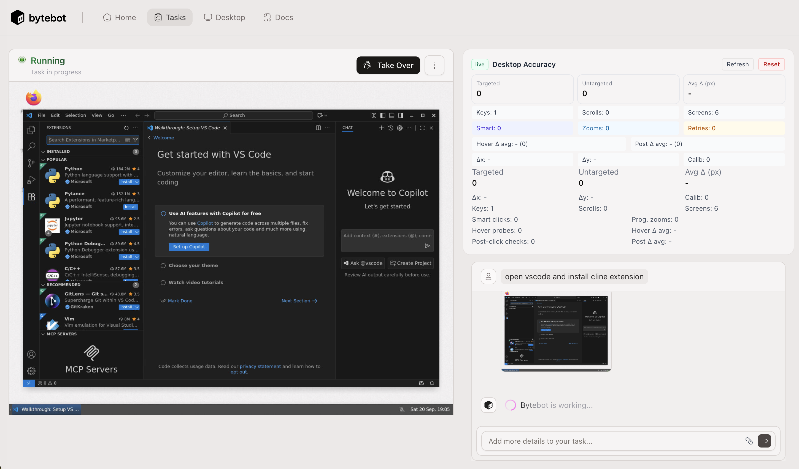

<div align="center">


# Bytebot: Open-Source AI Desktop Agent

**An AI that has its own computer to complete tasks for you**

[](https://railway.com/deploy/bytebot?referralCode=L9lKXQ)
</div>

<details>
<summary><strong>Resources &amp; Translations</strong></summary>

<div align="center">

<a href="https://trendshift.io/repositories/14624" target="_blank"></a>

[](https://github.com/bytebot-ai/bytebot/tree/main/docker)
[](LICENSE)
[](https://discord.com/invite/d9ewZkWPTP)

[🌐 Website](https://bytebot.ai) • [📚 Documentation](https://docs.bytebot.ai) • [💬 Discord](https://discord.com/invite/d9ewZkWPTP) • [𝕏 Twitter](https://x.com/bytebot_ai)

<!-- Keep these links. Translations will automatically update with the README. -->
[Deutsch](https://zdoc.app/de/bytebot-ai/bytebot) |
[Español](https://zdoc.app/es/bytebot-ai/bytebot) |
[français](https://zdoc.app/fr/bytebot-ai/bytebot) |
[日本語](https://zdoc.app/ja/bytebot-ai/bytebot) |
[한국어](https://zdoc.app/ko/bytebot-ai/bytebot) |
[Português](https://zdoc.app/pt/bytebot-ai/bytebot) |
[Русский](https://zdoc.app/ru/bytebot-ai/bytebot) |
[中文](https://zdoc.app/zh/bytebot-ai/bytebot)

</div>
</details>

---

## Hawkeye Fork Enhancements

Hawkeye layers precision tooling on top of upstream Bytebot so the agent can land clicks with far greater reliability:

| Capability | Hawkeye | Upstream Bytebot |
| --- | --- | --- |
| **Grid overlay guidance** | Always-on 100 px grid with labeled axes and optional debug overlays toggled via `BYTEBOT_GRID_OVERLAY`/`BYTEBOT_GRID_DEBUG`, plus a live preview in the [overlay capture](docs/images/hawkeye-desktop.png). | No persistent spatial scaffolding; relies on raw screenshots. |
| **Smart Focus targeting** | Three-stage coarse→focus→click workflow with tunable grids and prompts described in [Smart Focus System](docs/SMART_FOCUS_SYSTEM.md). | Single-shot click reasoning without structured zoom or guardrails. |
| **Progressive zoom capture** | Deterministic zoom ladder with cyan micro-grids that map local→global coordinates; see [zoom samples](test-zoom-with-grid.png). | Manual zoom commands with no coordinate reconciliation. |
| **Coordinate telemetry & accuracy** | Telemetry pipeline with `BYTEBOT_COORDINATE_METRICS` and `BYTEBOT_COORDINATE_DEBUG`, achieving ~70% precision per [Coordinate Accuracy Improvements](COORDINATE_ACCURACY_IMPROVEMENTS.md). | No automated accuracy measurement or debug dataset. |
| **Universal coordinate mapping** | Shared lookup in `config/universal-coordinates.yaml` bundled in repo and `@bytebot/shared`, auto-discovered without extra configuration. | Requires custom configuration for consistent coordinate frames. |
| **Accessible UI theming** | Header theme toggle powered by Next.js theme switching delivers high-contrast light/dark palettes so operators can pick the most legible view. | Single default theme without in-app toggles. |

Flip individual systems off by setting the corresponding environment variables—`BYTEBOT_UNIVERSAL_TEACHING`, `BYTEBOT_ADAPTIVE_CALIBRATION`, `BYTEBOT_ZOOM_REFINEMENT`, or `BYTEBOT_COORDINATE_METRICS`—to `false` (default `true`). Enable deep-dive logs with `BYTEBOT_COORDINATE_DEBUG=true` when troubleshooting.

### Smart Focus Targeting (Hawkeye Exclusive)

The fork’s Smart Focus workflow narrows attention in three deliberate passes—coarse region selection, focused capture, and final click—so the agent can reason about targets instead of guessing. Enable or tune it with `BYTEBOT_SMART_FOCUS`, `BYTEBOT_OVERVIEW_GRID`, `BYTEBOT_REGION_GRID`, `BYTEBOT_FOCUSED_GRID`, and related knobs documented in [docs/SMART_FOCUS_SYSTEM.md](docs/SMART_FOCUS_SYSTEM.md).

https://github.com/user-attachments/assets/f271282a-27a3-43f3-9b99-b34007fdd169



## Quick Start: Proxy Compose Stack

 The fastest way to try Hawkeye is the proxy-enabled Docker Compose stack—it starts the desktop, agent, UI, Postgres, and LiteLLM proxy with every precision upgrade flipped on. Populate `docker/.env` with your model keys **and** the Hawkeye-specific toggles before you launch. OpenRouter and LMStudio are first-class in the default LiteLLM config, so set the matching environment variables and make sure the aliases in [`packages/bytebot-llm-proxy/litellm-config.yaml`](packages/bytebot-llm-proxy/litellm-config.yaml) point to models you can reach:

- `OPENROUTER_API_KEY` powers the `openrouter-*` aliases like `openrouter-claude-3.7-sonnet`.
- LMStudio examples such as `local-lmstudio-gemma-3-27b` expect your local server’s `api_base` to match the running LMStudio instance.
- `BYTEBOT_GRID_OVERLAY=true` keeps the labeled coordinate grid on every capture.
- `BYTEBOT_PROGRESSIVE_ZOOM_USE_AI=true` enables the multi-zoom screenshot refinement.
- `BYTEBOT_SMART_FOCUS=true` and `BYTEBOT_SMART_FOCUS_MODEL=<litellm-alias>` route Smart Focus through the proxy model you configure in the LiteLLM config.
- `BYTEBOT_COORDINATE_METRICS=true` (plus optional `BYTEBOT_COORDINATE_DEBUG=true`) records the click accuracy telemetry that distinguishes the fork.

```bash
cat <<'EOF' > docker/.env
# Provider keys for LiteLLM
OPENAI_API_KEY=sk-your-key
ANTHROPIC_API_KEY=...
OPENROUTER_API_KEY=...

# Hawkeye precision defaults
BYTEBOT_GRID_OVERLAY=true
BYTEBOT_PROGRESSIVE_ZOOM_USE_AI=true
BYTEBOT_SMART_FOCUS=true
BYTEBOT_SMART_FOCUS_MODEL=gpt-4o-mini
BYTEBOT_COORDINATE_METRICS=true
EOF

docker compose -f docker/docker-compose.proxy.yml up -d
```

Before you start the stack, edit [`packages/bytebot-llm-proxy/litellm-config.yaml`](packages/bytebot-llm-proxy/litellm-config.yaml) so each alias maps to the OpenRouter endpoints or LMStudio bases you control. After saving changes, restart the `bytebot-llm-proxy` container (`docker compose restart bytebot-llm-proxy`) to reload the updated routing.

## Alternative Deployments

Looking for a different hosting environment? Follow the upstream guides for the full walkthroughs:

- [Railway one-click template](https://docs.bytebot.ai/deployment/railway)
- [Helm charts for Kubernetes](https://docs.bytebot.ai/deployment/helm)
- [Custom Docker Compose topologies](https://docs.bytebot.ai/deployment/litellm)

## Stay in Sync with Upstream Bytebot

For a full tour of the core desktop agent, installation options, and API surface, follow the upstream README and docs. Hawkeye inherits everything there—virtual desktop orchestration, task APIs, and deployment guides—so this fork focuses documentation on the precision tooling and measurement upgrades described above.

## Further Reading

- [Bytebot upstream README](https://github.com/bytebot-ai/bytebot#readme)
- [Quickstart guide](https://docs.bytebot.ai/quickstart)
- [API reference](https://docs.bytebot.ai/api-reference/introduction)

## Operations & Tuning

### Smart Click Success Radius

Smart click telemetry now records the real cursor landing position. Tune the pass/fail threshold by setting an environment variable on the desktop daemon:

```bash
export BYTEBOT_SMART_CLICK_SUCCESS_RADIUS=12  # pixels of acceptable drift
```

Increase the value if the VNC stream or hardware introduces more cursor drift, or decrease it to tighten the definition of a successful AI-guided click.
