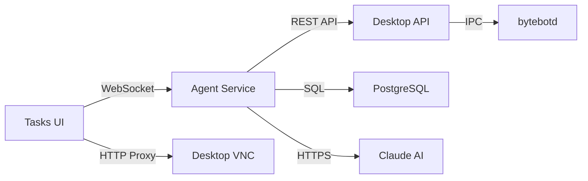

## Overview

Bytebot is a self-hosted AI desktop agent built with a modular, containerized architecture. It combines a Linux desktop environment with Claude AI to create an autonomous computer user that can perform tasks through natural language instructions.


## System Architecture

The system consists of four main components that work together:

### 1. Bytebot Desktop Container
The foundation of the system - a containerized Linux desktop that provides:

- **Ubuntu 22.04 LTS** base for stability and compatibility
- **XFCE4 Desktop** for a lightweight, responsive UI
- **bytebotd Daemon** - The automation service built on nutjs that executes computer actions
- **Pre-installed Applications**: Firefox ESR, Thunderbird, text editors, and development tools
- **VNC & noVNC** for remote desktop access

**Key Features:**
- Runs completely isolated from your host system
- Consistent environment across different platforms
- Can be customized with additional software
- Accessible via REST API on port 9990

### 2. AI Agent Service
The brain of the system - orchestrates tasks using an LLM:

- **NestJS Framework** for robust, scalable backend
- **LLM Integration** via OpenAI API for understanding and planning
- **WebSocket Support** for real-time updates
- **Computer Use API Client** to control the desktop

**Responsibilities:**
- Interprets natural language requests
- Plans sequences of computer actions
- Manages task state and progress
- Handles errors and retries

### 3. Web Task Interface
The user interface for interacting with your AI agent:

- **Next.js Application** with TypeScript for type safety
- **Embedded VNC Viewer** to watch the desktop in action
- **Task Management** UI for tracking progress
- **WebSocket Connections** for live updates

**Features:**
- Intuitive task interface
- Visual feedback of desktop actions
- Task history and status
- Export conversation logs

### 4. PostgreSQL Database
Persistent storage for the agent system:

- **Tasks Table**: Stores task details, status, and metadata
- **Messages Table**: Stores AI conversation history
- **Prisma ORM** for type-safe database access

## Data Flow

### Task Execution Flow

<Steps>
  <Step title="User Input">
    User describes a task in natural language via the chat UI
  </Step>
  <Step title="Task Creation">
    Agent service creates a task record and adds it to the processing queue
  </Step>
  <Step title="AI Planning">
    Claude AI analyzes the task and generates a plan of computer actions
  </Step>
  <Step title="Action Execution">
    Agent sends computer actions to bytebotd daemon via REST API
  </Step>
  <Step title="Desktop Automation">
    bytebotd executes actions (mouse, keyboard, screenshots) on the desktop
  </Step>
  <Step title="Result Processing">
    Agent receives results, updates task status, and continues or completes
  </Step>
  <Step title="User Feedback">
    Results and status updates are sent back to the user in real-time
  </Step>
</Steps>

### Communication Protocols



## Security Architecture

### Isolation Layers

1. **Container Isolation**
   - Each desktop runs in its own Docker container
   - No access to host filesystem by default
   - Network isolation with explicit port mapping

2. **Process Isolation**
   - bytebotd runs as non-root user
   - Separate processes for different services
   - Resource limits enforced by Docker

3. **Network Security**
   - Services only accessible from localhost by default
   - Can be configured with authentication
   - HTTPS/WSS for external connections

### API Security

- **Desktop API**: No authentication by default (localhost only)
- **Agent API**: Can be secured with API keys
- **Database**: Password protected, not exposed externally
- **VNC Access**: Optional password protection

<Warning>
  Default configuration is for development. For production:
  - Enable authentication on all APIs
  - Use HTTPS/WSS for all connections
  - Implement network policies
  - Rotate credentials regularly
</Warning>

## Deployment Patterns

### Single User (Development)
```yaml
Services: All on one machine
Scale: 1 instance each
Use Case: Personal automation, development
Resources: 4GB RAM, 2 CPU cores
```

### Team Deployment
```yaml
Services: Separate agent and desktop hosts
Scale: Multiple desktop containers
Use Case: Shared automation platform
Resources: 8GB+ RAM, 4+ CPU cores
```

### Enterprise Deployment
```yaml
Services: Kubernetes orchestration
Scale: Auto-scaling based on load
Use Case: Organization-wide automation
Resources: Dedicated cluster
```

## Extension Points

### Custom Tools
Add specialized software to the desktop:
```dockerfile
FROM bytebot/desktop:latest
RUN apt-get update && apt-get install -y \
    your-custom-tools
```

### AI Integrations
Extend agent capabilities:
- Custom tools for the LLM
- Additional AI models
- Specialized prompts
- Domain-specific knowledge

## Performance Considerations

### Resource Usage
- **Desktop Container**: ~1GB RAM idle, 2GB+ active
- **Agent Service**: ~256MB RAM
- **UI Service**: ~128MB RAM
- **Database**: ~256MB RAM

### Optimization Tips
1. Use lightweight desktop environments
2. Limit concurrent tasks
3. Monitor resource usage
4. Scale horizontally for more capacity

## Next Steps

<CardGroup cols={2}>
  <Card title="Agent System" icon="robot" href="/core-concepts/agent-system">
    Learn about the AI agent capabilities
  </Card>
  <Card title="Desktop Environment" icon="desktop" href="/core-concepts/desktop-environment">
    Explore the containerized desktop
  </Card>
  <Card title="API Reference" icon="code" href="/api-reference/introduction">
    Integrate with your applications
  </Card>
  <Card title="Deployment Guide" icon="rocket" href="/quickstart">
    Deploy your own instance
  </Card>
</CardGroup>